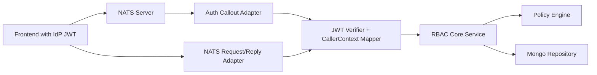

# RBAC Over NATS Design

**Date:** 2026-03-09

**Goal:** Evolve the RBAC service from an HTTP-first API into a transport-agnostic authorization core that serves NATS auth callout and NATS request/reply permission checks for frontend clients using an existing IdP JWT.

## Current State

The current service is organized around reusable `service`, `policy`, and `repository` layers, but its transport edge is still HTTP-specific.

- [`internal/rbac/handler/handler_common.go`](C:/Users/wenmo/work/codex/rbac7/internal/rbac/handler/handler_common.go) extracts caller identity from `x-user-id`.
- [`internal/rbac/handler/rbac_middleware.go`](C:/Users/wenmo/work/codex/rbac7/internal/rbac/handler/rbac_middleware.go) performs policy checks with Echo request parsing and the same header-based identity model.
- [`internal/rbac/service/service_common.go`](C:/Users/wenmo/work/codex/rbac7/internal/rbac/service/service_common.go) already contains transport-independent permission logic that can be reused by NATS adapters.

## Scope

This design covers:

- NATS auth callout for coarse-grained connection and subject grants
- NATS request/reply endpoints for fine-grained RBAC checks
- Shared JWT verification against the existing IdP
- Caller identity normalization across HTTP and NATS
- Migration from FE->HTTP to FE->NATS

This design does not cover:

- Replacing the current MongoDB schema
- Rewriting the policy engine
- Expanding fine-grained permissions into NATS subject grants
- A new identity provider

## Recommended Architecture

Keep the RBAC core and add new transport adapters around it.



### Layer Responsibilities

**Identity layer**

- Verify JWT signature and standard claims
- Map claims into a trusted `CallerContext`
- Apply tenant or namespace normalization rules

**Authorization core**

- Reuse current service methods and policy engine
- Accept a `CallerContext` instead of raw `callerID string`
- Keep all permission logic in one place

**Transport adapters**

- HTTP adapter remains temporarily for compatibility and health checks
- NATS auth callout adapter returns coarse subject grants only
- NATS RPC adapter exposes fine-grained RBAC operations

**Observability**

- Emit request id, caller id, subject, permission target, allow or deny, and latency
- Distinguish auth callout metrics from application permission-check metrics

## Identity Model

Introduce a shared caller representation:

```go
type CallerContext struct {
    UserID       string
    UserType     string
    ActiveTenant string
    OrgIDs       []string
    Subject      string
    Audience     []string
    ExpiresAt    time.Time
    RawClaims    map[string]any
}
```

### Rules

- The RBAC core must trust only `CallerContext`, never FE-supplied `user_id`.
- HTTP requests and NATS messages must both pass through the same JWT verification and claims mapping path.
- Namespace or tenant used by RBAC must come from verified claims or server-side mapping, not arbitrary request body fields.

## NATS Responsibilities

### Auth Callout

The auth callout is responsible only for coarse-grained authorization:

- Allow or deny connection
- Grant a minimal set of subjects
- Return connection-scoped identity metadata

It must not encode resource-level RBAC into NATS grants.

### Request/Reply

Fine-grained authorization remains in the RBAC service and is accessed through NATS RPC.

## Subject Design

### Internal subject

- `rbac.auth.callout`
  Used only by the NATS server or auth integration path

### FE-facing RBAC subjects

- `rbac.check`
- `rbac.check.batch`
- `rbac.roles.me`

### Optional future subjects

- `rbac.roles.list`
- `rbac.logs.list`
- administrative mutation subjects

These should be deferred until the read and check paths are stable.

## Message Contracts

Use a consistent request envelope:

```json
{
  "request_id": "uuid",
  "token": "jwt",
  "data": {}
}
```

Use a consistent response envelope:

```json
{
  "request_id": "uuid",
  "code": "ok",
  "message": "",
  "data": {},
  "meta": {
    "latency_ms": 3
  }
}
```

### `rbac.check`

Request `data`:

```json
{
  "permission": "resource.dashboard.read",
  "scope": "resource",
  "namespace": "NS1",
  "resource_id": "d1",
  "resource_type": "dashboard",
  "parent_resource_id": ""
}
```

Response `data`:

```json
{
  "allowed": true,
  "reason_code": "role_match"
}
```

### `rbac.check.batch`

Request `data`:

```json
{
  "permission": "resource.dashboard.read",
  "resource_type": "dashboard",
  "resource_ids": ["d1", "d2", "d3"]
}
```

Response `data`:

```json
{
  "results": {
    "d1": true,
    "d2": false,
    "d3": true
  }
}
```

### `rbac.roles.me`

Request `data`:

```json
{
  "scope": "resource",
  "resource_type": "dashboard"
}
```

Response `data`:

```json
{
  "roles": []
}
```

## Auth Callout Decision Model

The auth callout response should contain:

- `allow`
- `user_id`
- `expires_at`
- `pub.allow`
- `sub.allow`
- `deny_reason`

Recommended coarse grants:

- `_INBOX.>`
- `rbac.check`
- `rbac.check.batch`
- `rbac.roles.me`
- required application request subjects such as `app.rpc.>`

Do not grant:

- `>`
- broad wildcard subjects without a clear product need
- resource-specific subjects derived from RBAC state

## Service Refactor Requirements

### Core API changes

Refactor service methods so they can accept `CallerContext` or an equivalent trusted identity object rather than raw caller ids.

This affects:

- permission check paths
- role listing paths
- mutation audit paths
- any future NATS adapters

### Middleware changes

Current Echo middleware and handlers should become thin transport adapters:

- parse request
- verify token
- build `CallerContext`
- call the core

No business logic should remain coupled to Echo request parsing.

## Caching and Performance

Minimum caching:

- JWKS cache with key rotation support
- in-process policy cache

Optional caching:

- short-lived permission result cache keyed by caller, permission, and target resource

Constraints:

- Role changes must invalidate or naturally expire permission cache quickly
- Batch checks must enforce a maximum payload size

## Failure Policy

Recommended default is fail closed.

- JWT verification failure: deny
- JWKS unavailable: deny after bounded retry
- RBAC service unavailable during auth callout: deny connection
- RBAC timeout during `rbac.check`: return explicit error to FE

## Observability

Required telemetry:

- auth callout requests, denies, and latency
- `rbac.check` QPS and latency
- `rbac.check.batch` payload size distribution
- JWT verification failures by reason
- deny counts by permission and resource type

Required audit fields:

- `request_id`
- `user_id`
- `subject`
- `permission`
- `scope`
- `namespace`
- `resource_id`
- `resource_type`
- `decision`
- `reason_code`

## Migration Plan

1. Introduce `CallerContext` and shared JWT verification without changing RBAC policy behavior.
2. Add NATS RPC endpoints for `rbac.check`, `rbac.check.batch`, and `rbac.roles.me`.
3. Migrate FE fine-grained permission checks from HTTP to NATS request/reply.
4. Add auth callout for connection admission and minimal subject grants.
5. Reduce HTTP usage to compatibility, health, and administrative paths.

## Risks

- Divergent identity mapping between HTTP and NATS if they do not share one verifier
- Stale permission decisions if cache TTL is too long
- Excessive NATS fan-out if FE overuses batch checks
- Over-broad subject grants that bypass RBAC intent

## Decision Summary

- Existing IdP JWT remains the source of truth
- NATS auth callout is coarse-grained only
- Fine-grained authorization uses NATS request/reply
- RBAC core remains service and policy driven
- HTTP is no longer the frontend's primary integration path
