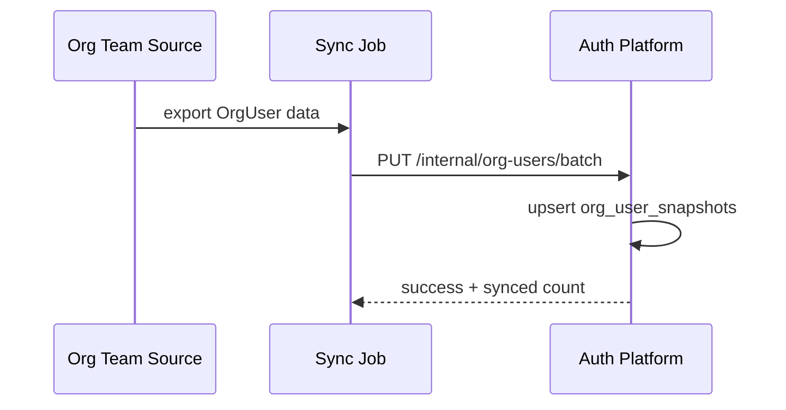
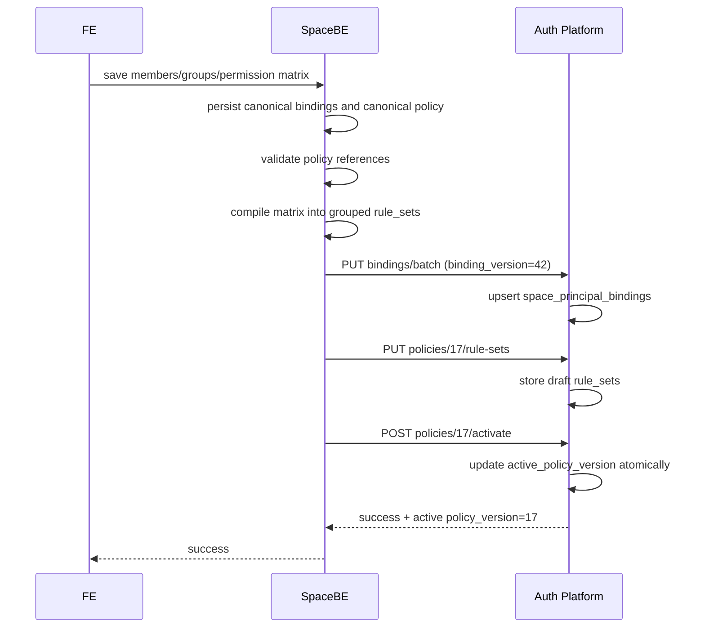
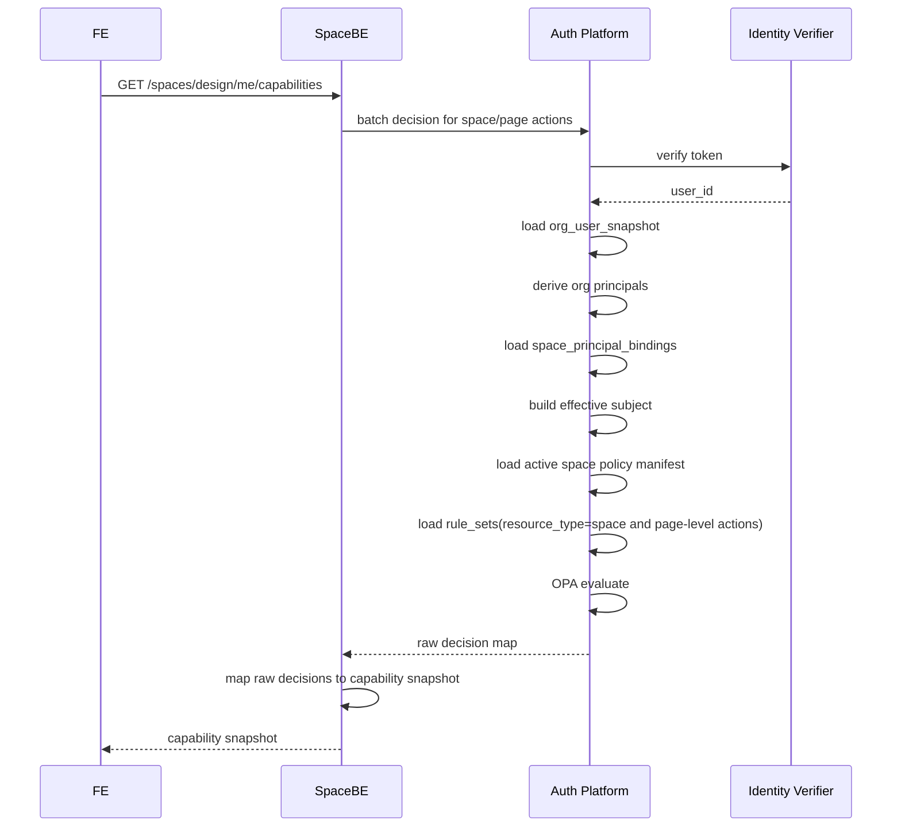
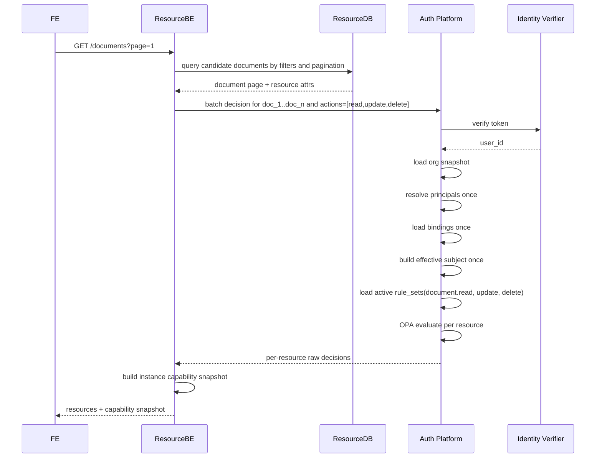
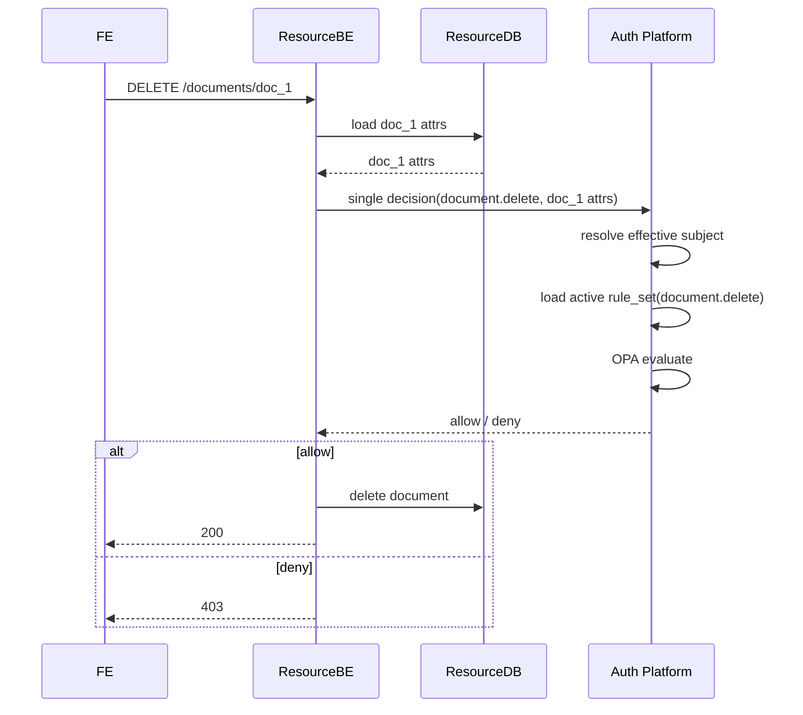
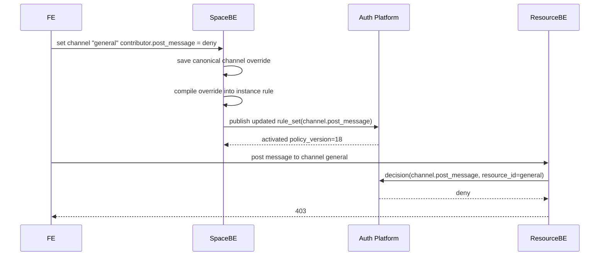

# Space Authorization Design (ABAC + OPA, Option B)

## Status

Approved design draft for implementation planning.

## Date

2026-03-29

## Summary

This design introduces space-scoped authorization using a hybrid ABAC model backed by OPA.

The core approach is:

- `Space BE` owns the human-editable authorization model for a space.
- `Auth Platform` owns authorization decision execution.
- `OrgUser` data is synchronized daily into `Auth Platform` as a local snapshot.
- `FE` does not call raw permission-check APIs directly.
- `Space BE` and `Resource BE` expose capability snapshot APIs to `FE`.
- `Resource BE` remains responsible for candidate resource queries and hard enforcement before data mutation.

This is intentionally not a pure RBAC system and not a pure "store every resource ACL in the auth service" design. It is a practical ABAC design where role, group, org, and resource metadata are normalized into attributes and evaluated by OPA at decision time.

## Goals

- Support space-level authorization.
- Support group-based authorization.
- Support org-based authorization.
- Support resource-type and resource-instance authorization.
- Support channel-level override behavior.
- Support FE capability rendering without FE directly calling raw decision APIs.
- Keep `query available resources` in `Resource BE`, not in `Auth Platform`.
- Keep hot-path authorization data local in `Auth Platform`.

## Non-Goals

- Building a new authentication system.
- Moving resource master data into `Auth Platform`.
- Making `Auth Platform` the source of truth for space groups or permission-matrix editing UI.
- Implementing monthly or real-time sync for org data in this phase. Daily sync is assumed.

## Assumptions

- Authentication is owned by another team.
- `Auth Platform` can verify incoming user tokens through an external identity/authentication platform.
- `OrgUser` source data is owned by another team and synchronized into `Auth Platform` daily.
- `Space BE` is the source of truth for:
  - space membership
  - group master data
  - space-scoped principal bindings
  - canonical permission matrix
- `Resource BE` is the source of truth for resource metadata.
- `FE` needs capability snapshots, not raw decision APIs.

## Architecture

### Responsibility Split

| Component | Responsibility |
|---|---|
| `FE` | Render UI using capability snapshots returned by backend APIs |
| `Space BE` | Manage members, groups, space canonical policy, compile policy projections, expose space/page capability APIs |
| `Resource BE` | Query candidate resources, load resource attributes, call `Auth Platform` for batch decisions, enforce write authorization |
| `Auth Platform` | Verify token, load local authorization data, run OPA decisions, return allow/deny |
| `Org Source` | Source of truth for org attributes |

### PAP / PDP / PIP / PEP Mapping

| Role | Component |
|---|---|
| `PAP` | `Space BE` |
| `PDP` | `Auth Platform` + OPA |
| `PIP` | `org_user_snapshots`, `space_principal_bindings`, resource attrs from `Resource BE` |
| `PEP` | `Space BE` and `Resource BE` |

## Data Ownership

| Data | Source of Truth | Stored in Auth Platform | Notes |
|---|---|---:|---|
| OrgUser | Org source system | Yes | Daily synchronized snapshot |
| Space group master data | Space BE | No | Name, description, lifecycle, UI state stay in Space BE |
| Space principal bindings | Space BE | Yes | Compiled projection for decision hot path |
| Canonical permission matrix | Space BE | No | Human-editable representation |
| Compiled space policy | Space BE compiles, Auth stores | Yes | Decision-time rule data |
| Resource master data | Resource BE | No | Passed in at check time |

## Data Model

### 1. `org_user_snapshots`

Purpose:

- Local copy of org attributes required for decision evaluation.

Recommended schema:

```json
{
  "user_id": "u_123",
  "function_ids": ["func_a", "func_b"],
  "division_id": "div_1",
  "dept_id": "dept_9",
  "sect_id": "sect_3",
  "employment_status": "active",
  "source_updated_at": "2026-03-29T00:00:00Z",
  "synced_at": "2026-03-29T01:00:00Z"
}
```

Recommended indexes:

- `(user_id)` unique
- `(division_id)`
- `(dept_id)`
- `(sect_id)`

### 2. `space_principal_bindings`

Purpose:

- Represent which principals are granted which space-scoped identities.
- Support both `user` and `org` principals.

Principal types:

- `user`
- `org`

Recommended schema:

```json
{
  "space_id": "design",
  "principal_type": "user",
  "principal_id": "u_123",
  "grant_tokens": [
    "space:design:role:member",
    "space:design:group:backend",
    "space:design:group:reviewers"
  ],
  "binding_version": 42,
  "source_updated_at": "2026-03-29T09:15:00Z",
  "updated_at": "2026-03-29T09:15:01Z"
}
```

Org binding example:

```json
{
  "space_id": "design",
  "principal_type": "org",
  "principal_id": "dept_9",
  "grant_tokens": [
    "space:design:role:member"
  ],
  "binding_version": 43,
  "source_updated_at": "2026-03-29T09:16:00Z",
  "updated_at": "2026-03-29T09:16:01Z"
}
```

Recommended indexes:

- `(space_id, principal_type, principal_id)` unique
- `(space_id, binding_version)`

### 3. `space_policy_manifests`

Purpose:

- Track the active compiled policy version for each space.

Recommended schema:

```json
{
  "space_id": "design",
  "active_policy_version": 17,
  "compiler_version": "v1",
  "published_at": "2026-03-29T09:20:00Z",
  "source_matrix_version": 23,
  "checksum": "sha256:...",
  "status": "active"
}
```

Recommended indexes:

- `(space_id)` unique

### 4. `space_policy_rule_sets`

Purpose:

- Store OPA-consumable policy data grouped by `(space_id, policy_version, resource_type, action)`.
- Avoid loading an entire space policy document on every decision.

Recommended schema:

```json
{
  "space_id": "design",
  "policy_version": 17,
  "resource_type": "channel",
  "action": "post_message",
  "default_effect": "deny",
  "compiled_at": "2026-03-29T09:20:00Z",
  "rules": [
    {
      "rule_id": "r_001",
      "source_kind": "channel_override",
      "source_ref": "channel:general:contributor:post_message",
      "effect": "deny",
      "priority": 1000,
      "target_scope": "instance",
      "target_resource_id": "general",
      "principal_any": ["space:design:role:contributor"],
      "subject_conditions": [],
      "resource_conditions": [],
      "env_conditions": [],
      "enabled": true
    }
  ]
}
```

Recommended indexes:

- `(space_id, policy_version, resource_type, action)` unique
- `(space_id, resource_type, action)`

### 5. Resource Attributes

Purpose:

- Runtime attributes passed in by `Resource BE`.

Recommended schema:

```json
{
  "space_id": "design",
  "resource_id": "doc_1",
  "resource_type": "document",
  "resource_parent_id": "",
  "owner_id": "u_456",
  "classification": "restricted",
  "visibility": "space",
  "allowed_group_ids": ["reviewers"],
  "denied_group_ids": [],
  "inherit_from_space": true
}
```

## Token Model

### Identity Tokens

Identity tokens represent direct principals.

Examples:

- `space:{space_id}:user:{user_id}`
- `space:{space_id}:org:{org_id}`

### Grant Tokens

Grant tokens represent effective identities that policy rules refer to.

Examples:

- `space:{space_id}:role:{role}`
- `space:{space_id}:group:{group_id}`

### Why Both Exist

Identity tokens answer:

- who is the principal?

Grant tokens answer:

- what space-scoped roles and groups has this principal been granted?

This separation keeps principal resolution and policy evaluation decoupled.

## Effective Subject Resolution

At decision time, `Auth Platform` builds an effective subject as follows:

1. Verify token and extract `user_id`.
2. Load `org_user_snapshot`.
3. Derive org principals from the org snapshot.
4. Generate identity tokens for:
   - the user
   - each relevant org identifier
5. Load all `space_principal_bindings` for those principals.
6. Union all `grant_tokens`.
7. Derive `group_ids` from grant tokens.
8. Build OPA subject input.

Example effective subject:

```json
{
  "user_id": "u_123",
  "status": "active",
  "org": {
    "function_ids": ["func_a", "func_b"],
    "division_id": "div_1",
    "dept_id": "dept_9",
    "sect_id": "sect_3"
  },
  "principal_tokens": [
    "space:design:user:u_123",
    "space:design:org:dept_9",
    "space:design:role:member",
    "space:design:group:reviewers"
  ],
  "group_ids": ["reviewers"]
}
```

## Canonical Policy Model in Space BE

`Space BE` stores the human-editable authorization model.

This canonical model should include:

- roles
- actions
- resource types
- permission matrix
- group rules
- org rules
- resource-instance overrides
- channel-specific overrides
- inheritance behavior

Example canonical policy:

```json
{
  "space_id": "design",
  "matrix_version": 23,
  "roles": ["owner", "admin", "member", "guest", "contributor"],
  "permissions": [
    {
      "resource_type": "document",
      "action": "read",
      "cells": {
        "owner": "allow",
        "admin": "allow",
        "member": "allow",
        "guest": "inherit",
        "contributor": "inherit"
      }
    }
  ],
  "group_rules": [
    {
      "resource_type": "document",
      "action": "read",
      "when": {
        "classification": "restricted"
      },
      "allow_groups": ["reviewers"]
    }
  ],
  "org_rules": [
    {
      "resource_type": "space",
      "action": "view",
      "allow_org_ids": ["dept_9"]
    }
  ],
  "resource_overrides": [
    {
      "resource_type": "channel",
      "resource_id": "general",
      "action": "post_message",
      "cells": {
        "contributor": "deny"
      }
    }
  ]
}
```

## Permission Matrix -> Compiled ABAC Policy

### Compile Goals

- Convert human-editable matrix data into runtime decision rules.
- Keep Rego static and generic.
- Store policy as data, not as generated code.
- Resolve UI-specific concepts into deterministic OPA-friendly structures.

### Compile Output Shape

Compiler output is:

- immutable `policy_version`
- grouped rule sets by `(space_id, policy_version, resource_type, action)`
- deterministic `rule_id`
- consistent priority and conflict semantics

### Tri-State Semantics

Each permission matrix cell is one of:

- `allow`
- `deny`
- `inherit`

Compile semantics:

- `allow` -> emit allow rule
- `deny` -> emit deny rule
- `inherit` -> emit no rule at this layer

`inherit` never emits an allow rule by itself.

### Recommended Priority Model

| Rule Source | Effect | Priority |
|---|---|---:|
| Instance override | deny | 1000 |
| Instance override | allow | 950 |
| Conditional org/group rule | deny | 900 |
| Conditional org/group rule | allow | 850 |
| Role matrix rule | deny | 800 |
| Role matrix rule | allow | 750 |
| Materialized fallback | deny | 700 |
| Materialized fallback | allow | 650 |
| Default | deny | 0 |

Conflict handling:

- Higher priority wins.
- Same priority prefers `deny`.
- Compiler should reject contradictory rules from the same source row.

### Compile Rule 1: Space-Level Actions

Examples:

- `space.view`
- `space.manage_members`
- `space.manage_groups`
- `space.manage_permissions`

Compilation:

- `resource_type = "space"`
- `action = "{action_name}"`
- `target_scope = "type"`
- `target_resource_id = null`

Example:

UI matrix:

- `Admin` allow `space.manage_members`

Compiled rule:

```json
{
  "resource_type": "space",
  "action": "manage_members",
  "effect": "allow",
  "priority": 750,
  "principal_any": ["space:design:role:admin"],
  "subject_conditions": [],
  "resource_conditions": [],
  "source_kind": "role_matrix"
}
```

### Compile Rule 2: Resource-Type Actions

Examples:

- `document.read`
- `document.delete`
- `file.create`
- `task.update`
- `channel.post_message`

Compilation:

- each `allow` or `deny` cell becomes one rule
- `inherit` emits no rule
- rules are grouped into the rule set for that resource type and action

Example:

UI matrix:

- `Member` allow `document.read`
- `Admin` allow `document.delete`

Compiled rules:

```json
{
  "resource_type": "document",
  "action": "read",
  "effect": "allow",
  "priority": 750,
  "principal_any": ["space:design:role:member"],
  "source_kind": "role_matrix"
}
```

```json
{
  "resource_type": "document",
  "action": "delete",
  "effect": "allow",
  "priority": 750,
  "principal_any": ["space:design:role:admin"],
  "source_kind": "role_matrix"
}
```

### Compile Rule 3: Channel Override and Resource-Instance Override

Examples:

- `general` channel denies `Contributor` from `post_message`
- one specific document is only visible to a review group

Compilation:

- `target_scope = "instance"`
- `target_resource_id = specific resource id`
- override priority must be higher than type-level rules

Example:

Canonical override:

- `channel:general`, `post_message`, `contributor = deny`

Compiled rule:

```json
{
  "resource_type": "channel",
  "action": "post_message",
  "effect": "deny",
  "priority": 1000,
  "target_scope": "instance",
  "target_resource_id": "general",
  "principal_any": ["space:design:role:contributor"],
  "source_kind": "channel_override"
}
```

Override `inherit` means:

- do not emit an instance rule
- fall back to resource-type rule evaluation

If the UI supports "copy settings from another channel", that copy must be resolved in `Space BE` before compilation. `Auth Platform` should only receive flattened rules.

### Compile Rule 4: Group Rules

Group support splits into two separate responsibilities.

Group membership:

- stored as `grant_tokens` in `space_principal_bindings`
- not emitted as policy rules

Group-based permission:

- emitted as compiled policy rules

Example:

Canonical rule:

- group `reviewers` can read restricted documents

Compiled rule:

```json
{
  "resource_type": "document",
  "action": "read",
  "effect": "allow",
  "priority": 850,
  "principal_any": ["space:design:group:reviewers"],
  "resource_conditions": [
    { "field": "classification", "operator": "eq", "value": "restricted" }
  ],
  "source_kind": "group_rule"
}
```

### Compile Rule 5: Org Rules

Org support also splits into two separate responsibilities.

Org principal binding:

- stored in `space_principal_bindings`
- used to derive role/group identities from org membership

Org-based permission:

- emitted as compiled policy rules

Example A:

Canonical binding:

- `dept_9` enters the space as `member`

Compiled binding:

```json
{
  "space_id": "design",
  "principal_type": "org",
  "principal_id": "dept_9",
  "grant_tokens": ["space:design:role:member"]
}
```

Example B:

Canonical permission:

- `dept_9` members can `space.view`

Compiled rule:

```json
{
  "resource_type": "space",
  "action": "view",
  "effect": "allow",
  "priority": 850,
  "principal_any": ["space:design:org:dept_9"],
  "source_kind": "org_rule"
}
```

### Compile Pipeline

1. Load canonical policy from `Space BE`.
2. Validate roles, groups, org ids, resource types, and actions.
3. Resolve `copy` relationships.
4. Expand tri-state cells into explicit rule candidates.
5. Convert role/group/org targets into token references.
6. Assign priority by source type and effect.
7. Generate deterministic `rule_id` values.
8. Group rules by `(resource_type, action)`.
9. Publish all grouped rule sets to `Auth Platform` as a draft policy version.
10. Activate the version atomically.

### Compiler Validation Rules

- Reject unknown `resource_type`.
- Reject unknown action keys.
- Reject unknown `group_id`.
- Reject unknown `org_id`.
- Reject overrides that reference missing resource ids when strict validation is enabled.
- Reject contradictory allow and deny emitted from one canonical row.
- Require published policy versions to be immutable.

## Recommended `space_policy_projection` Schema

The recommended schema is two-part:

- manifest document for version tracking
- grouped rule-set documents for runtime loading

### Manifest

```json
{
  "space_id": "design",
  "active_policy_version": 17,
  "compiler_version": "v1",
  "source_matrix_version": 23,
  "checksum": "sha256:compiled-policy-checksum",
  "published_at": "2026-03-29T09:20:00Z",
  "status": "active"
}
```

### Rule Set

```json
{
  "space_id": "design",
  "policy_version": 17,
  "resource_type": "document",
  "action": "read",
  "default_effect": "deny",
  "compiled_at": "2026-03-29T09:20:00Z",
  "rules": [
    {
      "rule_id": "role-matrix-document-read-member",
      "source_kind": "role_matrix",
      "source_ref": "matrix:document:read:member",
      "effect": "allow",
      "priority": 750,
      "target_scope": "type",
      "target_resource_id": null,
      "principal_any": ["space:design:role:member"],
      "subject_conditions": [],
      "resource_conditions": [],
      "env_conditions": [],
      "enabled": true
    },
    {
      "rule_id": "group-rule-document-read-reviewers-restricted",
      "source_kind": "group_rule",
      "source_ref": "group_rule:reviewers:document:read",
      "effect": "allow",
      "priority": 850,
      "target_scope": "type",
      "target_resource_id": null,
      "principal_any": ["space:design:group:reviewers"],
      "subject_conditions": [],
      "resource_conditions": [
        { "field": "classification", "operator": "eq", "value": "restricted" }
      ],
      "env_conditions": [],
      "enabled": true
    }
  ]
}
```

### Rule Fields

| Field | Meaning |
|---|---|
| `rule_id` | Deterministic identifier |
| `source_kind` | `role_matrix`, `group_rule`, `org_rule`, `channel_override`, `resource_override` |
| `source_ref` | Traceable link back to canonical source |
| `effect` | `allow` or `deny` |
| `priority` | Numeric priority |
| `target_scope` | `type` or `instance` |
| `target_resource_id` | Specific resource id for instance-level rules |
| `principal_any` | Any matching principal token grants rule eligibility |
| `subject_conditions` | Additional subject constraints |
| `resource_conditions` | Additional resource constraints |
| `env_conditions` | Future extension point |
| `enabled` | Rule on/off flag |

## Decision Model

### Inputs

Decision evaluation input contains:

- `subject`
- `resource`
- `action`
- `rule_set`

Recommended input shape:

```json
{
  "subject": {
    "user_id": "u_123",
    "status": "active",
    "org": {
      "function_ids": ["func_a", "func_b"],
      "division_id": "div_1",
      "dept_id": "dept_9",
      "sect_id": "sect_3"
    },
    "principal_tokens": [
      "space:design:user:u_123",
      "space:design:org:dept_9",
      "space:design:role:member",
      "space:design:group:reviewers"
    ],
    "group_ids": ["reviewers"]
  },
  "resource": {
    "space_id": "design",
    "resource_id": "doc_1",
    "resource_type": "document",
    "owner_id": "u_456",
    "classification": "restricted",
    "visibility": "space",
    "allowed_group_ids": ["reviewers"],
    "denied_group_ids": []
  },
  "action": "read",
  "rule_set": {}
}
```

### Evaluation Order

1. Validate `space_id`, `resource_type`, and `action`.
2. Load active `policy_version`.
3. Load the matching `rule_set`.
4. Filter rules by `target_scope`:
   - instance rules for matching `resource_id`
   - type rules
5. Match `principal_any` against `subject.principal_tokens`.
6. Evaluate subject conditions.
7. Evaluate resource conditions.
8. Evaluate environment conditions when present.
9. Choose winning rules by priority.
10. Prefer `deny` on equal priority.
11. Fall back to `default_effect`.

## Capability Snapshot APIs

`FE` does not call raw decision APIs directly.

`Space BE` and `Resource BE` transform raw decision results into FE-friendly capability snapshots.

### 1. Space-Level Capabilities

Endpoint:

```text
GET /api/spaces/{space_id}/me/capabilities
```

Response:

```json
{
  "space_id": "design",
  "policy_version": 17,
  "capabilities": {
    "space.view": true,
    "space.manage_members": false,
    "space.manage_groups": false,
    "space.manage_permissions": false,
    "document.create": true,
    "file.create": true,
    "task.create": false,
    "channel.create": true,
    "audit_log.view": false
  }
}
```

### 2. Resource-Type Capabilities

Endpoint:

```text
POST /api/spaces/{space_id}/me/resource-type-capabilities
```

Request:

```json
{
  "resource_types": ["document", "file", "task", "channel"],
  "actions": ["create", "read", "update", "delete", "manage_permissions"]
}
```

Response:

```json
{
  "space_id": "design",
  "capabilities": {
    "document": { "create": true, "read": true, "update": true, "delete": false },
    "file": { "create": true, "read": true, "update": false, "delete": false },
    "task": { "create": false, "read": true, "update": false, "delete": false },
    "channel": { "create": true, "read": true, "update": false, "delete": false }
  }
}
```

### 3. Resource-Instance Capabilities

Endpoint:

```text
POST /api/spaces/{space_id}/me/resource-instance-capabilities
```

Request:

```json
{
  "resources": [
    { "resource_id": "doc_1", "resource_type": "document" },
    { "resource_id": "doc_2", "resource_type": "document" },
    { "resource_id": "ch_1", "resource_type": "channel" }
  ],
  "actions": ["read", "update", "delete", "manage_permissions"]
}
```

Response:

```json
{
  "space_id": "design",
  "results": {
    "doc_1": { "read": true, "update": true, "delete": false, "manage_permissions": false },
    "doc_2": { "read": true, "update": false, "delete": false, "manage_permissions": false },
    "ch_1": { "read": true, "update": false, "delete": false, "manage_permissions": true }
  }
}
```

## Internal Auth Platform APIs

These are backend-only APIs.

### Org Sync

```text
PUT /v2/internal/org-users/batch
```

### Principal Binding Projection

```text
PUT /v2/internal/spaces/{space_id}/bindings/batch
```

### Policy Projection Upload

```text
PUT /v2/internal/spaces/{space_id}/policies/{policy_version}/rule-sets
POST /v2/internal/spaces/{space_id}/policies/{policy_version}/activate
```

### Raw Decision APIs

```text
POST /v2/internal/decisions/check
POST /v2/internal/decisions/check/batch
```

## Sequence Diagrams

### Sequence 1: Daily OrgUser Sync



### Sequence 2: Save Space Permission Matrix and Publish Compiled Policy



### Sequence 3: FE Loads Space UI Capability Snapshot



### Sequence 4: FE Loads a Resource List and Row-Level Actions



### Sequence 5: Hard Enforcement for a Write Operation



### Sequence 6: Channel Override Example



## Performance Design

### Hot Path Requirements

The decision hot path should read only:

- `org_user_snapshot`
- relevant `space_principal_bindings`
- active `space_policy_manifest`
- one or more `space_policy_rule_sets`

### Recommended Cache Keys

- effective subject cache:
  - `(space_id, user_id, binding_version, org_sync_version)`
- rule-set cache:
  - `(space_id, policy_version, resource_type, action)`

### Batch Decision Strategy

For batch checks:

- resolve effective subject once
- load required rule sets once
- evaluate each resource instance against the same rule set

Do not reload policy rules per resource item.

### Query Available Resources

`Auth Platform` must not own candidate resource querying.

Correct flow:

1. `Resource BE` queries a candidate page from its own database.
2. `Resource BE` calls `Auth Platform` for batch decisions.
3. `Resource BE` returns:
   - filtered results
   - or full results with per-item capabilities

If result sets grow too large:

- page first
- authorize current page
- avoid auth-driven full table scans

## Required Engine Changes

Relative to the current repository, implementation will need:

- decision lookup keyed by `space_id + resource_type + action`
- OPA subject input extended with:
  - `principal_tokens`
  - `org`
- rule data support for:
  - `principal_any`
  - `target_scope`
  - `target_resource_id`
- field resolvers for org attributes and principal tokens
- batch evaluation that does not refetch rule data per resource

## Development Checklist

### Phase 1: Data Structures

- add `org_user_snapshots`
- add `space_principal_bindings`
- add `space_policy_manifests`
- add `space_policy_rule_sets`

### Phase 2: Projection APIs

- implement org-user batch sync API
- implement principal-binding projection API
- implement compiled policy upload API
- implement policy activation API

### Phase 3: Decision Engine

- extend OPA input model
- extend Rego field resolution
- add rule-set loading by `(space_id, policy_version, resource_type, action)`
- implement instance override handling

### Phase 4: Space BE Compiler

- define canonical policy schema
- validate canonical matrix
- compile matrix to grouped rule sets
- publish draft versions
- activate versions atomically

### Phase 5: Capability APIs

- implement `Space BE` capability endpoints
- implement `Resource BE` instance capability endpoints
- map raw decision results into FE capability snapshots

### Phase 6: Verification

- test user binding + org binding union behavior
- test deny-over-allow priority
- test type-level allow with instance-level deny override
- test group-based restricted document access
- test channel override behavior
- test stale binding version and stale policy version edge cases

## Final Recommendation

Use `Space BE` as the policy authoring and compilation layer, and use `Auth Platform` as a runtime decision engine backed by OPA.

The key rule for implementation is:

- bindings decide who the principal becomes in a space
- compiled policy decides what that principal may do
- resource attrs decide whether the rule applies to this specific resource instance

That split keeps the system aligned with OPA + ABAC while still supporting a role matrix UI, org bindings, group rules, and resource overrides without pushing domain ownership into `Auth Platform`.
