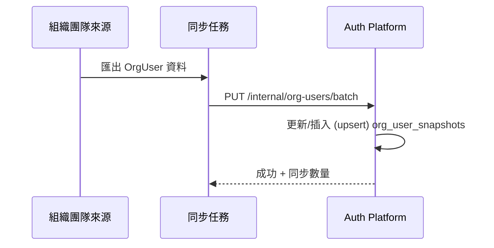
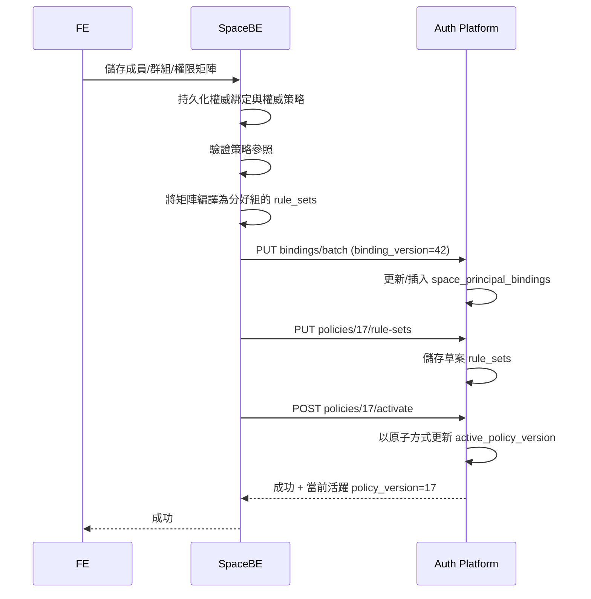
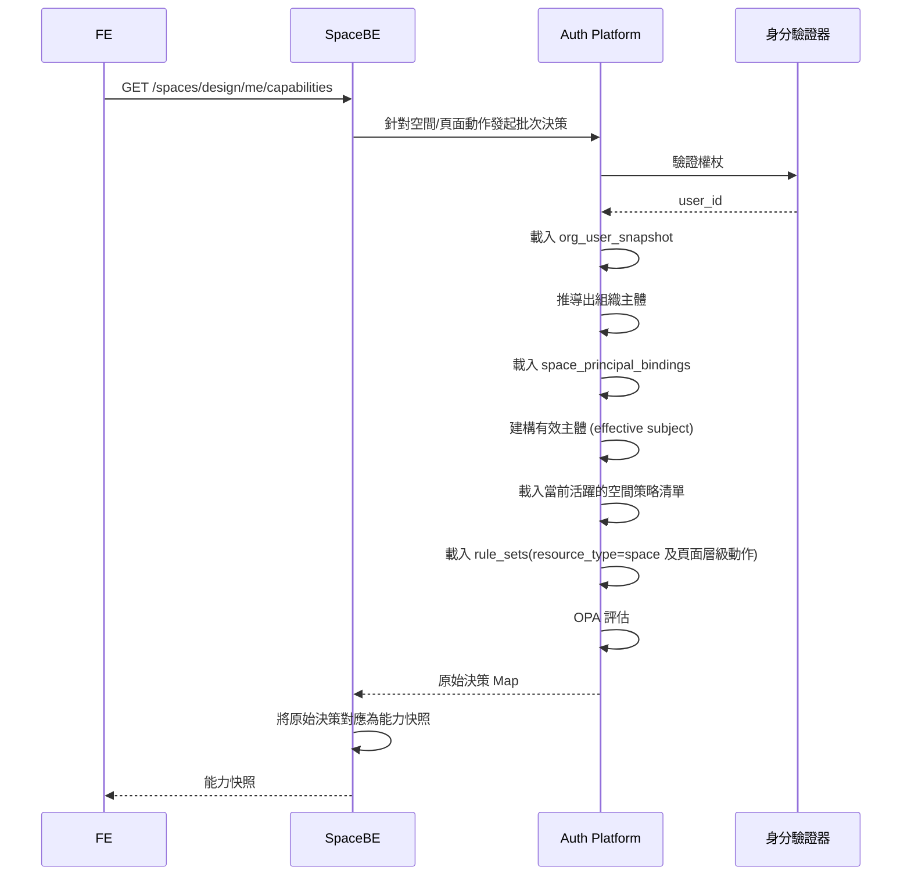
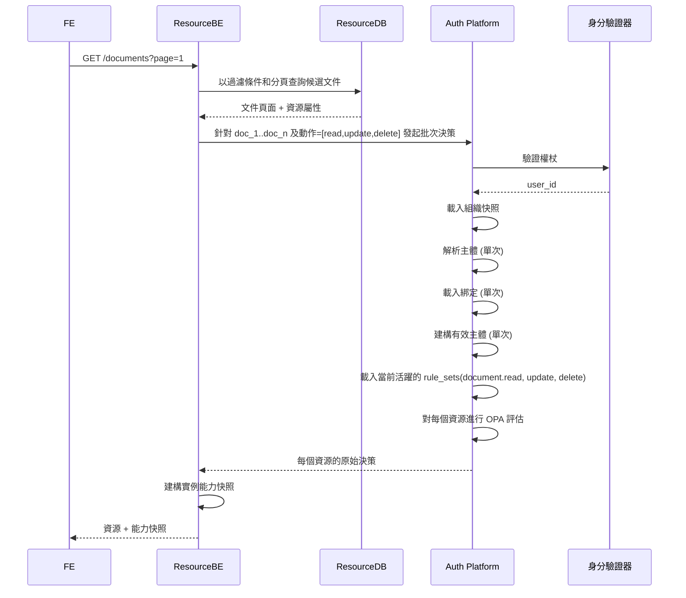
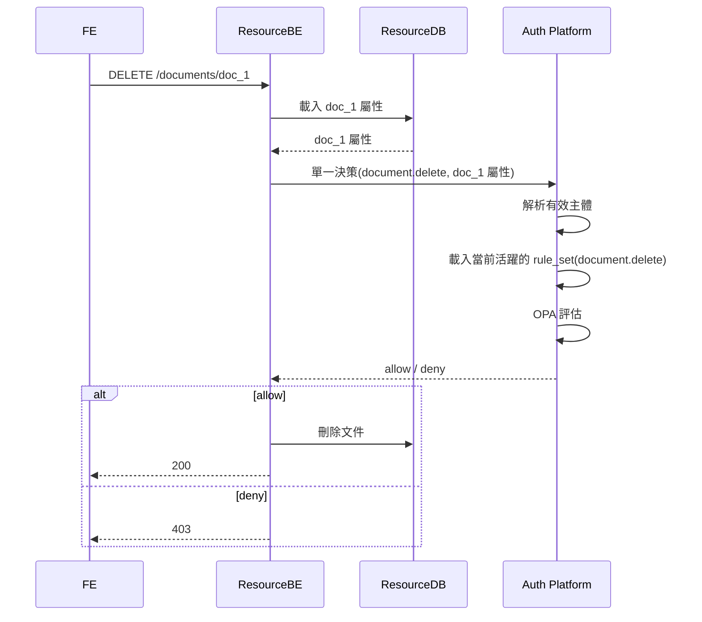
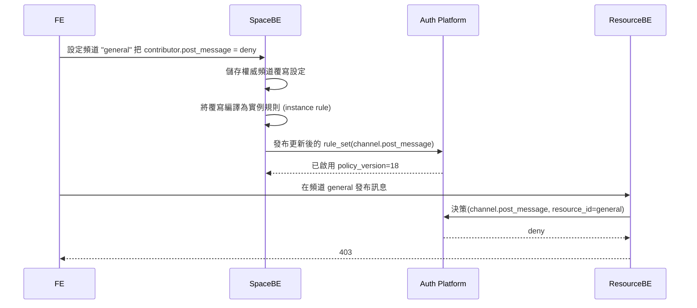

### 編譯規則 5：組織規則

組織支援同樣分為兩個獨立的職責。

組織主體綁定：

- 儲存在 `space_principal_bindings` 中
- 用於從組織成員身分推導出角色/群組身分

基於組織的權限：

- 作為編譯後的策略規則產出

範例 A：

權威綁定來源：

- `dept_9` 以 `member` 身分進入空間

編譯的綁定：

```json
{
  "space_id": "design",
  "principal_type": "org",
  "principal_id": "dept_9",
  "grant_tokens": ["space:design:role:member"]
}
```

範例 B：

權威權限來源：

- `dept_9` 的成員可以執行 `space.view`

編譯的規則：

```json
{
  "resource_type": "space",
  "action": "view",
  "effect": "allow",
  "priority": 850,
  "principal_any": ["space:design:org:dept_9"],
  "source_kind": "org_rule"
}
```

### 編譯管線 (Compile Pipeline)

1. 從 `Space BE` 載入權威策略。
2. 驗證角色、群組、組織 ID、資源類型以及動作。
3. 解析 `copy` (複製) 關係。
4. 將三態 (tri-state) 單元格展開為明確的候選規則。
5. 將角色/群組/組織目標轉換為權杖 (token) 參照。
6. 根據來源類型和效果 (effect) 分配優先順序。
7. 產生確定性的 `rule_id` 值。
8. 依據 `(resource_type, action)` 將規則分組。
9. 將所有分好組的規則集發布到 `Auth Platform` 作為草案策略版本。
10. 以原子 (atomic) 方式啟用該版本。

### 編譯器驗證規則

- 拒絕未知的 `resource_type`。
- 拒絕未知的動作 (action) 鍵。
- 拒絕未知的 `group_id`。
- 拒絕未知的 `org_id`。
- 當啟用嚴格驗證時，拒絕參照了不存在之資源 ID 的覆寫規則。
- 拒絕從同一權威資料列產出相互矛盾的 allow 和 deny 規則。
- 要求已發布的策略版本必須是不可變的 (immutable)。

## 建議的 `space_policy_projection` Schema 結構

建議的 Schema 由兩部分組成：

- 用於追蹤版本的清單 (manifest) 文件
- 供執行時期載入、分組好的規則集文件

### 清單 (Manifest)

```json
{
  "space_id": "design",
  "active_policy_version": 17,
  "compiler_version": "v1",
  "source_matrix_version": 23,
  "checksum": "sha256:compiled-policy-checksum",
  "published_at": "2026-03-29T09:20:00Z",
  "status": "active"
}
```

### 規則集 (Rule Set)

```json
{
  "space_id": "design",
  "policy_version": 17,
  "resource_type": "document",
  "action": "read",
  "default_effect": "deny",
  "compiled_at": "2026-03-29T09:20:00Z",
  "rules": [
    {
      "rule_id": "role-matrix-document-read-member",
      "source_kind": "role_matrix",
      "source_ref": "matrix:document:read:member",
      "effect": "allow",
      "priority": 750,
      "target_scope": "type",
      "target_resource_id": null,
      "principal_any": ["space:design:role:member"],
      "subject_conditions": [],
      "resource_conditions": [],
      "env_conditions": [],
      "enabled": true
    },
    {
      "rule_id": "group-rule-document-read-reviewers-restricted",
      "source_kind": "group_rule",
      "source_ref": "group_rule:reviewers:document:read",
      "effect": "allow",
      "priority": 850,
      "target_scope": "type",
      "target_resource_id": null,
      "principal_any": ["space:design:group:reviewers"],
      "subject_conditions": [],
      "resource_conditions": [
        { "field": "classification", "operator": "eq", "value": "restricted" }
      ],
      "env_conditions": [],
      "enabled": true
    }
  ]
}
```

### 規則欄位 (Rule Fields)

| 欄位 | 意義 |
|---|---|
| `rule_id` | 確定性的識別碼 |
| `source_kind` | `role_matrix`, `group_rule`, `org_rule`, `channel_override`, `resource_override` |
| `source_ref` | 可追溯回權威來源的參照連結 |
| `effect` | `allow` 或 `deny` |
| `priority` | 數值優先順序 |
| `target_scope` | `type` 或 `instance` |
| `target_resource_id` | 實例層級規則的特定資源 ID |
| `principal_any` | 只要有任何相符的主體權杖，即符合規則條件 |
| `subject_conditions` | 額外的主體限制條件 |
| `resource_conditions` | 額外的資源限制條件 |
| `env_conditions` | 未來的擴充點 (環境條件) |
| `enabled` | 規則開啟/關閉的旗標 |

## 決策模型

### 輸入

決策評估的輸入包含：

- `subject`
- `resource`
- `action`
- `rule_set`

建議的輸入格式：

```json
{
  "subject": {
    "user_id": "u_123",
    "status": "active",
    "org": {
      "function_ids": ["func_a", "func_b"],
      "division_id": "div_1",
      "dept_id": "dept_9",
      "sect_id": "sect_3"
    },
    "principal_tokens": [
      "space:design:user:u_123",
      "space:design:org:dept_9",
      "space:design:role:member",
      "space:design:group:reviewers"
    ],
    "group_ids": ["reviewers"]
  },
  "resource": {
    "space_id": "design",
    "resource_id": "doc_1",
    "resource_type": "document",
    "owner_id": "u_456",
    "classification": "restricted",
    "visibility": "space",
    "allowed_group_ids": ["reviewers"],
    "denied_group_ids": []
  },
  "action": "read",
  "rule_set": {}
}
```

### 評估順序

1. 驗證 `space_id`、`resource_type` 和 `action`。
2. 載入當前活躍的 `policy_version`。
3. 載入相符的 `rule_set`。
4. 依據 `target_scope` 過濾規則：
   - 尋找符合 `resource_id` 的 instance (實例) 規則
   - 尋找 type (類型) 規則
5. 將 `principal_any` 與 `subject.principal_tokens` 進行比對。
6. 評估主體條件 (subject conditions)。
7. 評估資源條件 (resource conditions)。
8. 若存在，評估環境條件 (env conditions)。
9. 依據優先順序選出獲勝的規則。
10. 在優先順序相同時，優先選擇 `deny`。
11. 回退到 `default_effect` (預設效果)。

## 能力快照 APIs (Capability Snapshot APIs)

`FE` 不會直接呼叫原始的決策 API。

`Space BE` 和 `Resource BE` 會將原始的分散式決策結果轉換為易於 FE 使用的能力快照。

### 1. 空間層級能力

端點 (Endpoint)：

```text
GET /api/spaces/{space_id}/me/capabilities
```

回應 (Response)：

```json
{
  "space_id": "design",
  "policy_version": 17,
  "capabilities": {
    "space.view": true,
    "space.manage_members": false,
    "space.manage_groups": false,
    "space.manage_permissions": false,
    "document.create": true,
    "file.create": true,
    "task.create": false,
    "channel.create": true,
    "audit_log.view": false
  }
}
```

### 2. 資源類型能力

端點：

```text
POST /api/spaces/{space_id}/me/resource-type-capabilities
```

請求 (Request)：

```json
{
  "resource_types": ["document", "file", "task", "channel"],
  "actions": ["create", "read", "update", "delete", "manage_permissions"]
}
```

回應：

```json
{
  "space_id": "design",
  "capabilities": {
    "document": { "create": true, "read": true, "update": true, "delete": false },
    "file": { "create": true, "read": true, "update": false, "delete": false },
    "task": { "create": false, "read": true, "update": false, "delete": false },
    "channel": { "create": true, "read": true, "update": false, "delete": false }
  }
}
```

### 3. 資源實例能力

端點：

```text
POST /api/spaces/{space_id}/me/resource-instance-capabilities
```

請求：

```json
{
  "resources": [
    { "resource_id": "doc_1", "resource_type": "document" },
    { "resource_id": "doc_2", "resource_type": "document" },
    { "resource_id": "ch_1", "resource_type": "channel" }
  ],
  "actions": ["read", "update", "delete", "manage_permissions"]
}
```

回應：

```json
{
  "space_id": "design",
  "results": {
    "doc_1": { "read": true, "update": true, "delete": false, "manage_permissions": false },
    "doc_2": { "read": true, "update": false, "delete": false, "manage_permissions": false },
    "ch_1": { "read": true, "update": false, "delete": false, "manage_permissions": true }
  }
}
```

## 內部 Auth Platform APIs

這些是僅供後端使用的 API。

### 組織同步 (Org Sync)

```text
PUT /v2/internal/org-users/batch
```

### 主體綁定投影 (Principal Binding Projection)

```text
PUT /v2/internal/spaces/{space_id}/bindings/batch
```

### 策略投影上傳 (Policy Projection Upload)

```text
PUT /v2/internal/spaces/{space_id}/policies/{policy_version}/rule-sets
POST /v2/internal/spaces/{space_id}/policies/{policy_version}/activate
```

### 原始決策 APIs

```text
POST /v2/internal/decisions/check
POST /v2/internal/decisions/check/batch
```

## 循序圖 (Sequence Diagrams)

### 序列 1：每日 OrgUser 同步



### 序列 2：儲存空間權限矩陣並發布編譯策略



### 序列 3：FE 載入空間 UI 能力快照



### 序列 4：FE 載入資源清單和資料列層級的動作



### 序列 5：針對寫入操作的嚴格強制執行 (Hard Enforcement)



### 序列 6：頻道覆寫範例



## 效能設計

### 熱路徑需求 (Hot Path Requirements)

決策熱路徑應該只讀取：

- `org_user_snapshot`
- 相關的 `space_principal_bindings`
- 當前活躍的 `space_policy_manifest`
- 一個或多個 `space_policy_rule_sets`

### 建議的快取鍵 (Cache Keys)

- 有效主體快取：
  - `(space_id, user_id, binding_version, org_sync_version)`
- 規則集快取：
  - `(space_id, policy_version, resource_type, action)`

### 批次決策策略

針對批次檢查：

- 單次解析有效主體
- 單次載入所需的規則集
- 使用同一個規則集來評估每個資源實例

避免對每個資源項目重新載入策略規則。

### 查詢可用資源

`Auth Platform` 絕對不得負責候選資源的查詢。

正確流程：

1. `Resource BE` 從自己的資料庫查詢出一頁的候選資料。
2. `Resource BE` 呼叫 `Auth Platform` 進行批次決策。
3. `Resource BE` 回傳：
   - 過濾後的結果
   - 或是完整結果，並附帶每個項目的能力

如果結果集變得過大：

- 先進行分頁
- 僅授權當前頁面
- 避免因授權而導致全資料表掃描 (full table scans)

## 引擎需做出的變更

相對於目前的 code repository，實作上還需要：

- 新增依據 `space_id + resource_type + action` 去查找決策的功能
- 在 OPA subject 輸入中擴充：
  - `principal_tokens`
  - `org`
- 讓規則資料支援：
  - `principal_any`
  - `target_scope`
  - `target_resource_id`
- 針對組織屬性與主體權杖實作欄位解析器 (field resolvers)
- 不會對每個資源重新抓取規則資料的批次評估機制

## 開發清單

### 階段 1：資料結構

- 新增 `org_user_snapshots`
- 新增 `space_principal_bindings`
- 新增 `space_policy_manifests`
- 新增 `space_policy_rule_sets`

### 階段 2：投影 APIs

- 實作組織使用者批次同步 API
- 實作主體綁定投影 API
- 實作已編譯策略上傳 API
- 實作策略啟用 API

### 階段 3：決策引擎

- 擴充 OPA 輸入模型
- 擴充 Rego 欄位解析
- 新增透過 `(space_id, policy_version, resource_type, action)` 載入規則集的功能
- 實作實例覆寫處理機制

### 階段 4：Space BE 編譯器

- 定義權威策略 Schema 結構
- 驗證權威矩陣
- 將矩陣編譯為分組的規則集
- 發布草案版本
- 以原子方式啟用版本

### 階段 5：能力 APIs

- 實作 `Space BE` 能力端點
- 實作 `Resource BE` 實例能力端點
- 將原始決策結果對應成 FE 能力快照

### 階段 6：驗證

- 測試 使用者綁定 + 組織綁定 的聯集行為
- 測試 deny-over-allow (拒絕優先) 的機制
- 測試類型層級的 allow 遭遇實例層級的 deny 覆寫
- 測試基於群組的受限制文件存取控制
- 測試頻道覆寫行為
- 測試陳舊 (stale) 的 binding version 和 policy version 等邊緣情況

## 最終建議

利用 `Space BE` 作為策略編寫和編譯層，並將 `Auth Platform` 作為由 OPA 支持的執行時期決策引擎。

實作的關鍵原則是：

- 綁定決定了主體在空間中成為「誰」
- 編譯的策略決定了該主體可以做「什麼」
- 資源屬性決定了該規則是否適用於「這一個特定的資源實例」

這種職責劃分使系統保持與 OPA + ABAC 的一致性，同時仍能支援角色矩陣 UI、組織綁定、群組規則和資源覆寫，而不會將領域的擁有權推向 `Auth Platform` 中。
