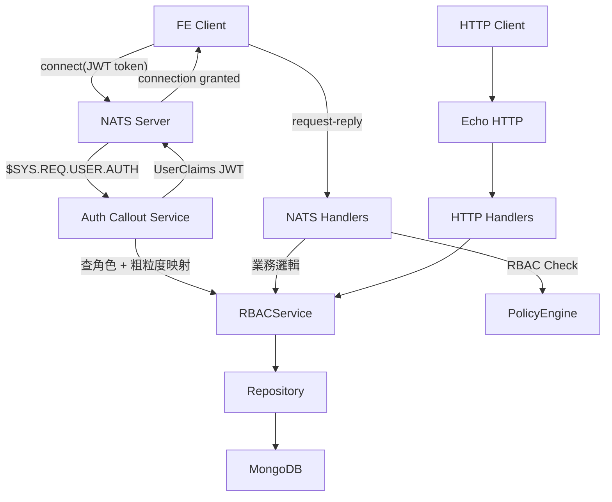

# NATS Auth Callout 整合 — 完成報告

## 架構概述

採用**方案 A（雙層檢查）**：Auth Callout 做粗粒度 NATS subject 過濾，NATS handler 裡仍透過 PolicyEngine 做細粒度 RBAC 檢查。Service/Repository/Policy 層完全不動。



## 變更檔案

### 修改

| 檔案 | 變更 |
|---|---|
| [config.go](file:///c:/Users/wenmo/work/rbac7/internal/rbac/config/config.go) | 新增 6 個 NATS 設定欄位 + 條件式驗證 |
| [main.go](file:///c:/Users/wenmo/work/rbac7/cmd/server/main.go) | 條件式啟動 NATS + HTTP 雙通道 + graceful shutdown |
| [go.mod](file:///c:/Users/wenmo/work/rbac7/go.mod) | 新增 nats.go, jwt/v2, nkeys, callout.go 依賴 |

### 新增

| 檔案 | 說明 |
|---|---|
| [auth_callout.go](file:///c:/Users/wenmo/work/rbac7/internal/rbac/nats/auth_callout.go) | Auth Callout 服務：JWT token 解析、角色查詢、UserClaims 簽署 |
| [permissions_map.go](file:///c:/Users/wenmo/work/rbac7/internal/rbac/nats/permissions_map.go) | RBAC 角色 → NATS subject 權限粗粒度映射 |
| [handler.go](file:///c:/Users/wenmo/work/rbac7/internal/rbac/nats/handler.go) | 17 個 NATS Request-Reply handlers |
| [middleware.go](file:///c:/Users/wenmo/work/rbac7/internal/rbac/nats/middleware.go) | NATSRBACChecker — 細粒度權限檢查 |
| [error.go](file:///c:/Users/wenmo/work/rbac7/internal/rbac/nats/error.go) | NATS 錯誤碼映射 |

## 新增環境變數

| 變數 | 預設值 | 必填 |
|---|---|---|
| `NATS_ENABLED` | `false` | 否 |
| `NATS_URL` | `nats://localhost:4222` | 否 |
| `NATS_AUTH_USER` | [auth](file:///c:/Users/wenmo/work/rbac7/internal/rbac/nats/auth_callout.go#89-146) | 否 |
| `NATS_AUTH_PASSWORD` | — | NATS 啟用時必填 |
| `NATS_ACCOUNT_SEED` | — | NATS 啟用時必填 |
| `NATS_ENCRYPTION_KEY` | — | 否 |

## NATS Subject 對照表

| Subject | Service 方法 | RBAC |
|---|---|---|
| `rbac.permissions.check` | CheckPermission | ❌ |
| `rbac.permissions.check.batch` | BatchCheckPermission | ❌ |
| `rbac.system.assign_owner` | AssignSystemOwner | ✅ |
| `rbac.system.transfer_owner` | TransferSystemOwner | ✅ |
| `rbac.system.assign_role` | AssignSystemUserRole | ✅ |
| `rbac.system.assign_roles_batch` | AssignSystemUserRoles | ✅ |
| `rbac.system.delete_role` | DeleteSystemUserRole | ✅ |
| `rbac.system.get_my_roles` | GetUserRolesMe | self |
| `rbac.system.get_members` | GetUserRoles | ✅ |
| `rbac.system.get_logs` | GetUserRoleHistory | ✅ |
| `rbac.resource.assign_owner` | AssignResourceOwner | none |
| `rbac.resource.transfer_owner` | TransferResourceOwner | ✅ |
| `rbac.resource.assign_role` | AssignResourceUserRole | ✅ |
| `rbac.resource.assign_roles_batch` | AssignResourceUserRoles | ✅ |
| `rbac.resource.delete_role` | DeleteResourceUserRole | ✅ |
| `rbac.resource.delete` | SoftDeleteResource | ✅ |
| `rbac.resource.get_dashboard` | GetDashboardResource | ✅ |

## 驗證結果

- ✅ `go build ./...` — 編譯通過
- ✅ `go vet ./internal/rbac/nats/...` — 無警告
- ✅ 22 個現有測試全部通過（無回歸）

## 後續步驟

1. **設定 NATS Server** — 安裝 NATS Server v2.10+ 並設定 auth callout config：
   ```
   authorization: {
     users: [{ user: auth, password: <YOUR_PASSWORD> }]
     auth_callout: {
       auth_users: [auth]
       issuer: <ACCOUNT_PUBLIC_KEY>
     }
   }
   jetstream: {}
   ```

2. **產生 NKey** — 使用 `nsc` 或 `nk` 工具產生 Account key pair：
   ```bash
   nsc generate nkey -a
   # 會輸出 Public Key (A...) 和 Seed (SA...)
   # Seed 設定為 NATS_ACCOUNT_SEED 環境變數
   # Public Key 設定到 nats-server config 的 issuer 欄位
   ```

3. **NATS 整合測試** — 需要運行中的 NATS Server + MongoDB

4. **FE 整合** — FE 使用 NATS client 連線時帶 JWT token
